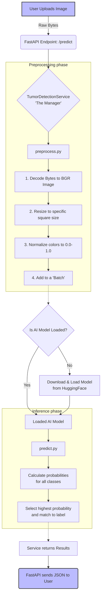

# Understanding the Prediction Pipeline

The prediction pipeline is the core journey that an image takes from the moment a user clicks "Upload" to the moment the AI spits out a diagnosis (like "Malignant" or "Benign"). This process is carefully orchestrated across several helper files to keep the code clean.

## The Journey: Step-by-Step

1. **The API Request (`main.py`)**: 
   A user uploads an image via the web browser. The FastAPI server receives this image at the `/predict` endpoint as raw byte data.
   
2. **The Service Layer (`service.py`)**: 
   The server passes the raw data to the `TumorDetectionService`. Think of this service as the "manager" that coordinates everything else.

3. **Image Preprocessing (`preprocess.py`)**: 
   Before the AI can look at the image, it must be formatted perfectly. The `preprocess_image` function does this:
   * **Decodes** the raw bytes into a visual image format (BGR colors).
   * **Resizes** the image to a perfectly square, standard size (e.g., 224x224) that the AI expects.
   * **Normalizes** the colors. Instead of pixel values from 0 to 255, it crushes them down to tiny decimals between 0.0 and 1.0. This makes the math easier for the AI.
   * **Batches** it. The AI always expects a *batch* of images, so even if we upload one image, it wraps it in a "batch of 1".

4. **Loading the Model (`loader.py` & `service.py`)**:
   The service checks if the AI's "brain" is loaded into memory. If not, it triggers `load_model()`, which securely downloads the pre-trained neural network from the HuggingFace Hub cloud and activates it. 

5. **Making the Prediction (`predict.py`)**:
   The perfectly formatted image is fed into `predict_image`. The Keras model calculates probabilities for every possible disease class. The function finds the highest probability, attaches the correct human-readable label (like "Tumor"), and returns it.

6. **The Response (`main.py`)**:
   The service hands the label (e.g., "Benign") and confidence score (e.g., "98.5%") back to the FastAPI endpoint, which finally packages it as a JSON response and sends it back to the user's screen.

---

## Flowchart of the Prediction Pipeline

