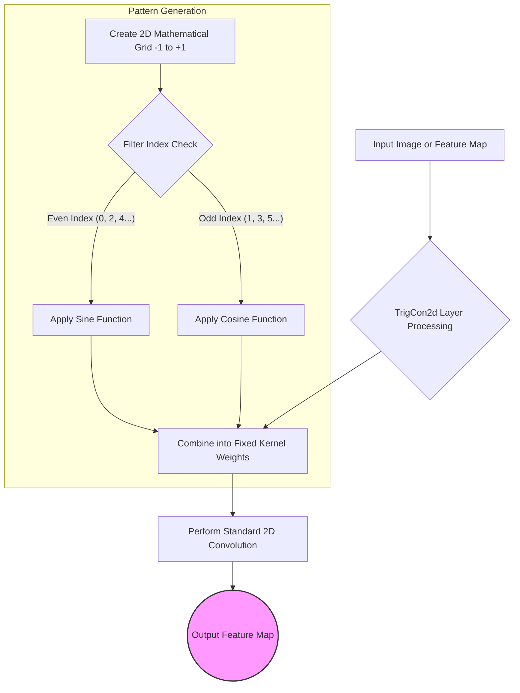

# Understanding TrigCon2d

`TrigCon2d` is a custom mathematical layer built for the AI model in this project. In standard Convolutional Neural Networks (CNNs), the "filters" (the tiny magnifying glasses the AI uses to look for patterns like edges or shapes) are randomly guessed at first, and the AI slowly learns the best patterns during training. 

In contrast, **TrigCon2d** doesn't learn these patterns. Instead, it uses **fixed, pre-calculated mathematical wave patterns**—specifically, Sine and Cosine waves.

## How it Works

1. **The Grid:** It creates a tiny 2D grid of numbers spanning from `-1` to `1` across both width and height.
2. **The Math (Sine and Cosine):** 
   * For **even-numbered filters** (Filter 0, Filter 2, etc.), it applies a `Sine` mathematical function across this grid, creating a wavy pattern.
   * For **odd-numbered filters** (Filter 1, Filter 3, etc.), it applies a `Cosine` mathematical function across the grid.
3. **The Application:** These wavy grids act as the "weights" or "filters". The layer simply slides these fixed wavy patterns across the input image.

### Why do this?
By using fixed frequency patterns, the layer forces the AI to look at specific textural and spatial frequencies in the tumor images right from the start. It's highly efficient because the AI doesn’t have to waste time figuring out these basic textural patterns itself; they are mathematically hardcoded. It also ensures the model is looking for mathematical regularity in images, which might be critical for scanning bodily tissues.

---

## Flowchart of TrigCon2d

