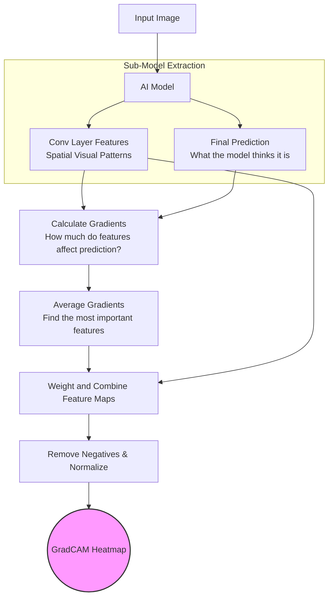
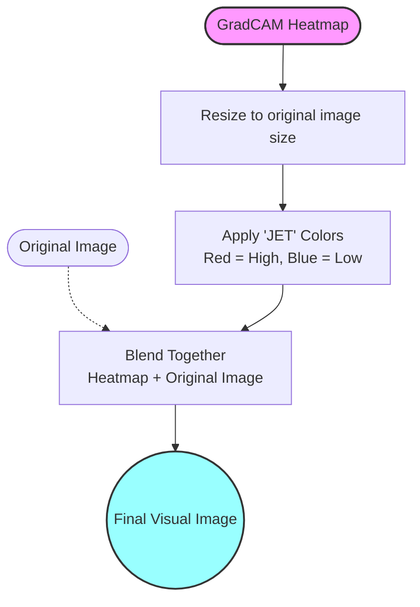

# Understanding GradCAM (Gradient-weighted Class Activation Mapping)

GradCAM is a technique used in computer vision to make Convolutional Neural Networks (CNNs) more interpretable. In simple words, when an AI model looks at an image (like an X-ray or MRI) and makes a prediction, GradCAM helps us answer the question: **"Which parts of this image did the AI look at to make its decision?"**

It does this by highlighting the important regions in the image, acting like a "heatmap" of the model's attention.

---

## How it Works: Step-by-Step

Our implementation is split into two main steps, handled by two functions in the code:
1. **Generating the Heatmap** (`get_gradcam_heatmap`)
2. **Overlaying the Heatmap** (`overlay_gradcam`)

### 1. Generating the Heatmap

This part computes *where* the model is looking.

*   **Step 1:** We take the trained AI model and the input image.
*   **Step 2:** We run the image through the model, but we extract two specific things:
    *   The output of the **last convolutional layer** (which contains rich spatial information about patterns in the image).
    *   The **final prediction** (the class the model is most confident about).
*   **Step 3:** We calculate the **gradients** (mathematical slopes). This tells us how much the final prediction would change if we slightly tweaked the visual patterns in that convolutional layer. 
*   **Step 4:** We average out these gradients. The features with higher average gradients are the ones most responsible for the final prediction.
*   **Step 5:** We multiply the convolutional layer's spatial maps by these averaged weights and combine them into a single 2D map.
*   **Step 6:** We pass this map through a ReLU function (which drops negative values, keeping only the features that positively pushed the model to its prediction) and normalize it to a scale of 0 to 1.

#### Flowchart for Generating the Heatmap

---

### 2. Overlaying the Heatmap

Once we have the 2D heatmap (a grid of numbers from 0 to 1), we need to display it in a way humans can understand by placing it over the original image.

*   **Step 1:** The raw heatmap is usually tiny (e.g., 7x7 or 14x14 pixels). We **resize** it to match the exact resolution of the original image.
*   **Step 2:** We apply a **color map** (specifically the "JET" colormap). This turns the raw numbers into colors: red represents high importance (hot), and blue represents low importance (cold).
*   **Step 3:** We **blend** this colorful heatmap together with the original black-and-white or colored image. They are blended proportionally so we can see both the heatmap colors and the original image details underneath.
*   **Step 4:** Finally, we ensure the image format is converted cleanly to standard RGB formatting so it looks correct on any screen or web browser.

#### Flowchart for Overlaying the Heatmap

---

## Summary

In short, GradCAM peeks inside the AI's "brain" (the last convolutional layer), calculates which visual patterns contributed most heavily toward the final diagnosis, and then paints a glowing red/yellow highlight over those specific areas on the original scan. This builds trust, showing doctors or users exactly *why* the AI made its prediction.
