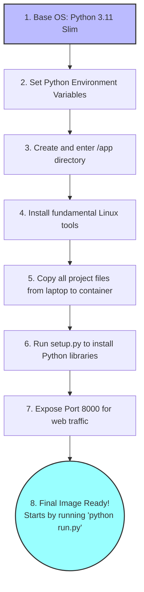

# Dockerfile Explanation

A **Dockerfile** is like a recipe for creating a "container". A container is an isolated, perfectly configured environment that contains everything needed to run your application. By using Docker, you ensure that if the code works on your laptop, it will definitely work exactly the same way on a cloud server without encountering the infamous "it works on my machine" errors.

---

## The Recipe: Step-by-Step

Here is exactly what our `Dockerfile` is instructing Docker to do when it builds the project's image:

1. **`FROM python:3.11-slim` (The Foundation):** 
   Instead of starting from absolute scratch, we borrow a lightweight, official Linux operating system that already has Python 3.11 installed. The `-slim` version is chosen to keep the final file size as small and fast to download as possible.

2. **`ENV ...` (The Settings):** 
   We configure Python to be Docker-friendly:
   * `PYTHONDONTWRITEBYTECODE=1`: Stops Python from creating cluttered, unnecessary `.pyc` cache files on the disk.
   * `PYTHONUNBUFFERED=1`: Ensures that any `print()` or logging messages are printed to your terminal immediately. Without this, Docker might hold onto the logs and hide them from you if the app crashes.

3. **`WORKDIR /app` (The Office):** 
   This creates a folder named `/app` inside the container and navigates into it. All future commands (and our code files) will be placed inside this specific folder.

4. **`RUN apt-get update...` (The System Tools):** 
   Before installing Python libraries, we need some fundamental Linux tools. `build-essential` provides C++ compiling tools that complex AI libraries sometimes require to install themselves. `curl` is used for downloading files from the internet. Finally, it cleans up (`rm -rf`) the installation cache to keep the container size small.

5. **`COPY . .` (The Code Integration):** 
   This copies every single file from your laptop's local project folder and pastes it directly into the container's `/app` folder.

6. **`RUN pip install ...` (The Python Dependencies):** 
   Now that the code is inside, it runs your `setup.py` file to install all the required Python libraries. The `--no-cache-dir` flag ensures pip doesn't save the raw temporary download files, keeping the image lightweight.

7. **`EXPOSE 8000` (The Network Door):** 
   This is purely documentation for Docker. It clearly states that once the container is running, the FastAPI web server will be listening for traffic on port `8000`.

8. **`CMD ["python", "run.py"]` (The Start Button):** 
   This is the final default command. After the entire recipe is built, when you finally hit "Run" on the container, it will automatically execute `python run.py` to start the web server.

---

## Flowchart of the Build Process

