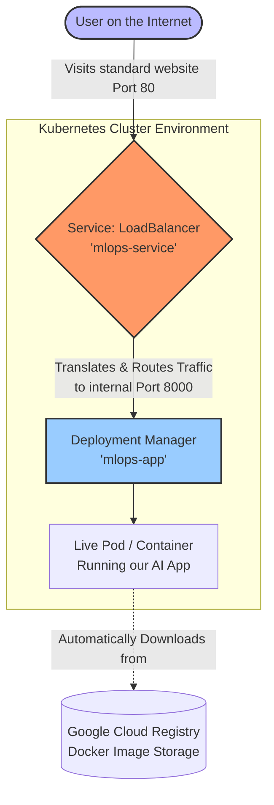

# Kubernetes Deployment Explanation

If Docker is the "recipe" for creating a single, perfect mini-computer (container) for our app, **Kubernetes (K8s)** is the manager that oversees a whole factory of these computers. It makes sure they stay running, handles internet traffic, and restarts them automatically if they crash.

This file (`kubernetes-deployment.yaml`) gives Kubernetes its instructions. It is split into two main sections: The **Deployment** and the **Service**.

---

## 1. The Deployment (The Factory)

The first half of the file tells Kubernetes *what* to run.

*   **`kind: Deployment`**: We are creating a deployment rule.
*   **`replicas: 1`**: We only want exactly 1 copy (container) of our app running at a time. If we had high traffic, we could change this to 5, and Kubernetes would instantly turn on 4 more copies to help share the load.
*   **`image: us-central1-docker.pkg.dev/...`**: This tells Kubernetes where to download the built Docker image from. In this case, it's downloading it securely from a Google Cloud storage bucket.
*   **`containerPort: 8000`**: This matches the `EXPOSE 8000` rule we set in the Dockerfile. It tells Kubernetes that the container's internal engine is listening on port 8000.

---

## 2. The Service (The Receptionist)

The second half of the file tells Kubernetes how to handle internet traffic. Containers are heavily shielded by default; nothing from the outside internet can reach them without K8s allowing it.

*   **`kind: Service`**: We are creating a networking rule.
*   **`selector: app: mlops-app`**: This is how the Service knows which containers it is managing. It looks for containers stamped with the "mlops-app" label (which our Deployment created above).
*   **`port: 80` vs `targetPort: 8000`**: 
    *   `port: 80` is the standard internet port. When a user visits a website normally, they use port 80.
    *   `targetPort: 8000` is the internal container port.
    *   Therefore, the Service acts as a translator: "When a user asks for port 80 on the internet, secretly tunnel their request to port 8000 on the container."
*   **`type: LoadBalancer`**: This is a powerful command. When you push this code to a cloud provider like Google Cloud or AWS, this single line commands the cloud provider to rent a physical, public IP address and set up a heavy-duty load balancer to guard your app.

---

## Flowchart of the Architecture

